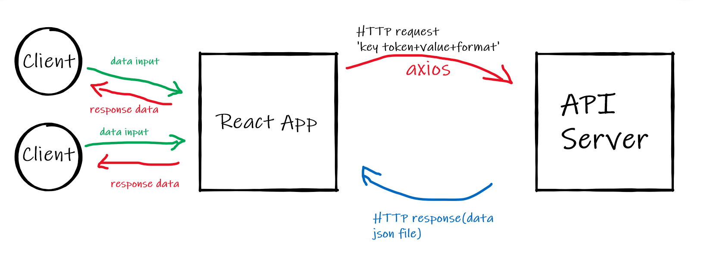

# city-explorer

**Author**: Mohammad Alzoubi
**Version**: 1.0.0

## Overview
<!-- Provide a high level overview of what this application is and why you are building it, beyond the fact that it's an assignment for this class. (i.e. What's your problem domain?) -->
City Explorer is a web App. that can be used to search about a certain city and give back info. to the user about the searched city.

## Getting Started
<!-- What are the steps that a user must take in order to build this app on their own machine and get it running? -->
user needs to initiate a react app.,  install all dependencies, install Axios, install react-bootstrap and some text editor like vs-code to write react code.

## Architecture
<!-- Provide a detailed description of the application design. What technologies (languages, libraries, etc) you're using, and any other relevant design information. -->

**Technologies used** :

- React.
- React-Bootstrap.
- Axios API.
- GIT.
- GitHub.
- Netlify.

## Change Log

<!-- Use this area to document the iterative changes made to your application as each feature is successfully implemented. Use time stamps. Here's an example:

01-01-2001 4:59pm - Application now has a fully-functional express server, with a GET route for the location resource. -->

## Credit and Collaborations
<!-- Give credit (and a link) to other people or resources that helped you build this application. -->